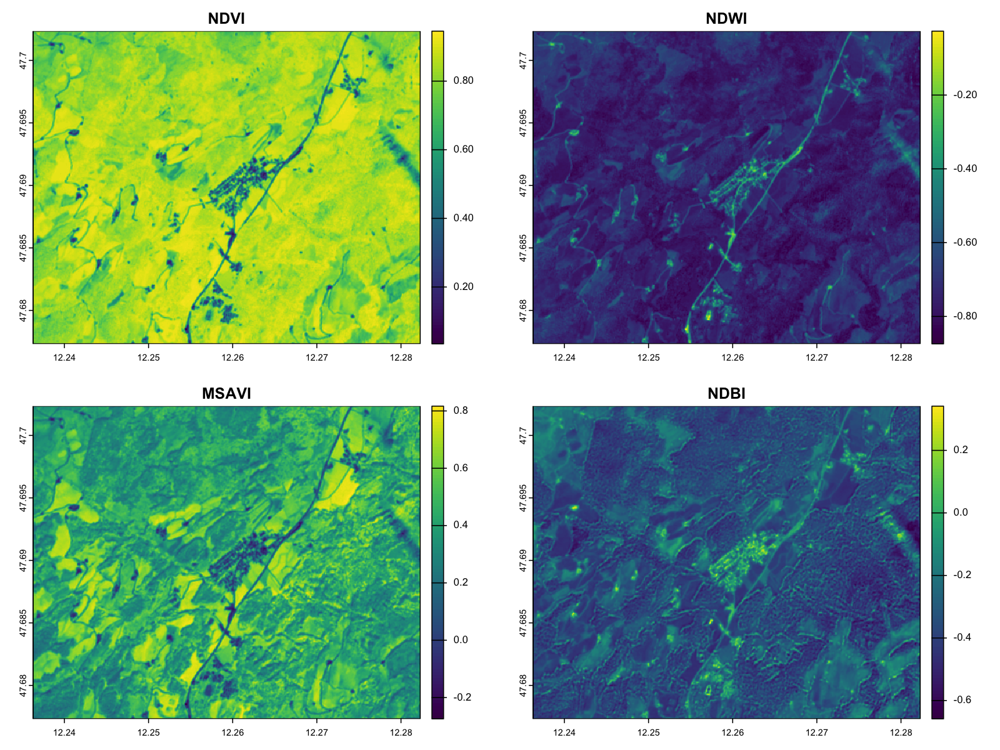
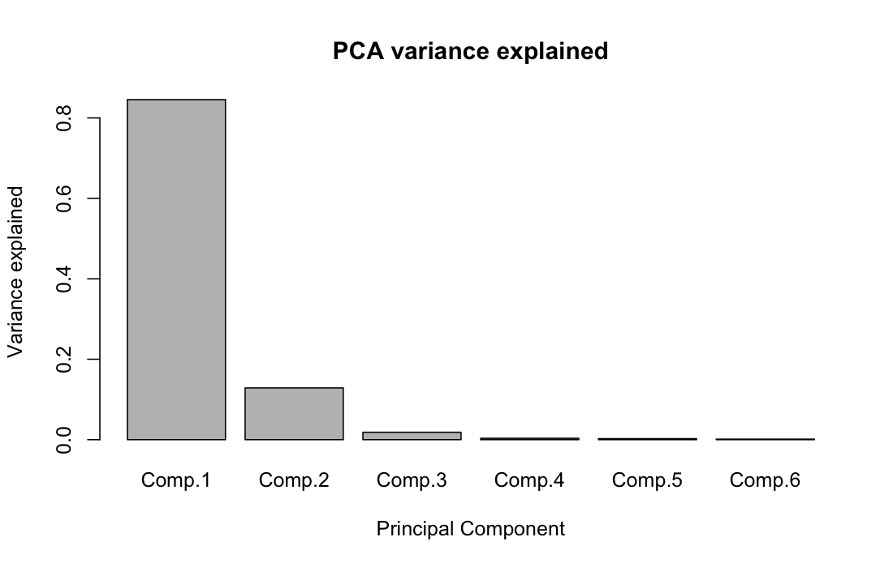
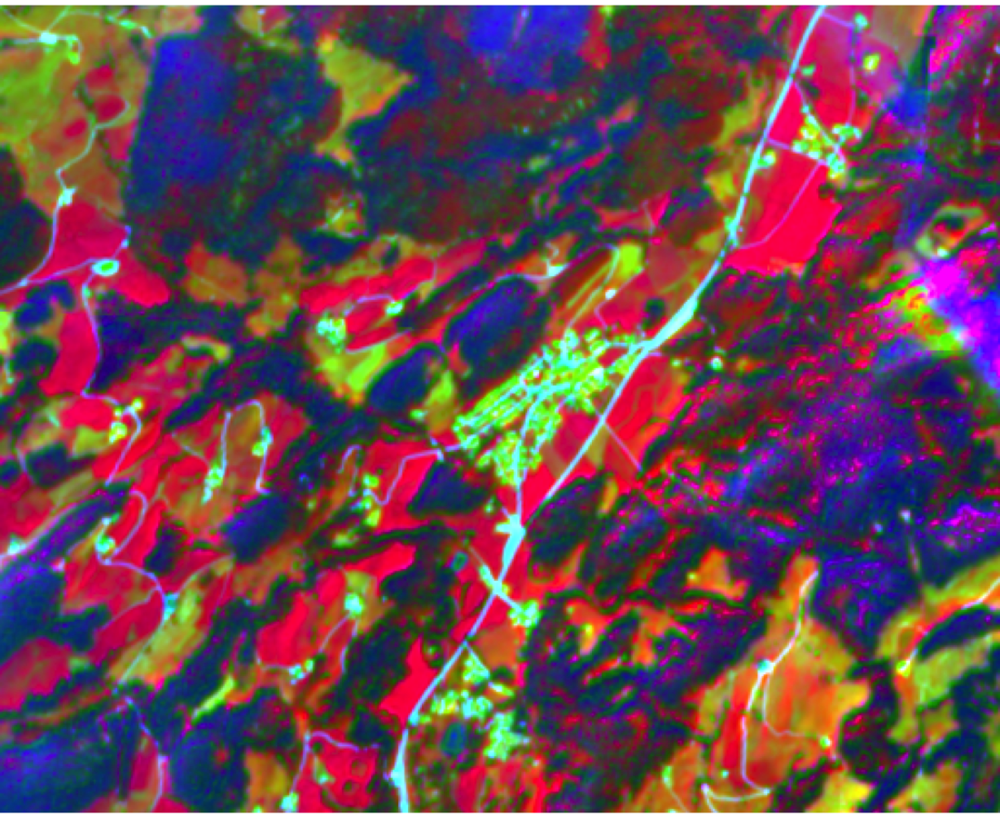
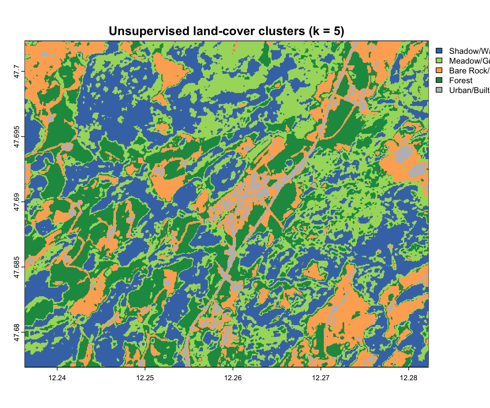
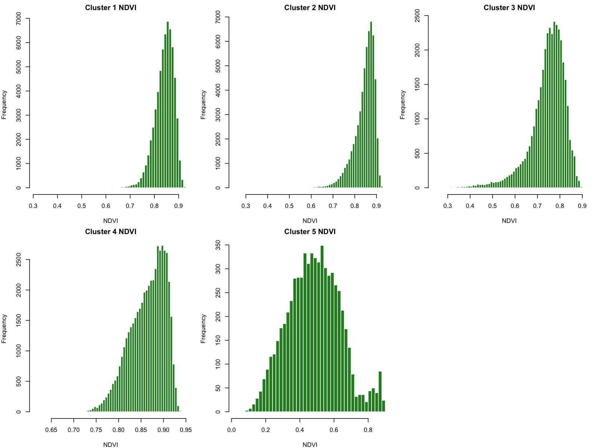

# Sentinel-2 Analysis of Sachrang

## Step 1: RGB Composites

The true-color composite (Bands 4-3-2) shows the landscape as seen by the human eye:  

The false-color composite (Bands 8-4-3) highlights vegetation in red tones:  

Compared to true color, vegetation health and land-use patterns stand out much more clearly.

## Step 2 – Spectral Indices

---

### NDVI – Normalized Difference Vegetation Index  
- Highlights vegetation health and density.  
- Values near **0.7–0.9** indicate **dense forest canopy** and healthy meadows.  
- Lower values (<0.3) correspond to **roads, rooftops, or bare ground**.  

---

### NDWI – Normalized Difference Water Index  
- Sensitive to **surface water and vegetation moisture**.  
- Most of the scene is **dry (low values)**, as expected in alpine uplands.  
- Brighter pixels may mark **wetter soils or river corridors**.  

---

### MSAVI – Modified Soil-Adjusted Vegetation Index  
- Similar to NDVI but reduces soil brightness influence.  
- Useful for **agriculture and grasslands** where vegetation is sparse.  
- High values align with **active crop or grass areas**.  

---

### NDBI – Normalized Difference Built-up Index  
- Distinguishes **built-up areas vs. vegetation**.  
- Positive values (yellow) → **villages, roads, rooftops**.  
- Negative values (blue) → **vegetated surfaces**.  

---

**Takeaway:**  
Sachrang is dominated by **healthy vegetation**, with **little open water**, and villages that are clearly highlighted in **NDBI** against the natural background.

# Step 3 – Principal Component Analysis (PCA)

We applied PCA to the six Sentinel-2 reflective bands (B02, B03, B04, B08, B11, B12) to reduce dimensionality and explore dominant spectral patterns.

---

### Variance Explained

- Most of the spectral variability can be summarized in just the first 2 components (PC1 ~ 85%; PC2 ~ 12%)

---

### RGB Composite of Principal Components

- The PCA composite highlights **contrasts between land-cover types**:  
  - **Bright red/orange patches** → agricultural fields and open areas with distinct spectral signals.  
  - **Green-yellow tones** → vegetated zones, especially forested areas.  
  - **Blue/purple areas** → likely shadowed terrain or spectrally mixed pixels.  
  - **bright linear features** → Roads and built-up areas, standing out against the natural background.  

---

**Takeaway:**  
 **PC1+PC2 already summarize ~97% of variability**, enabling clearer separation of land-cover classes (forest, meadows, settlements) while reducing noise and redundancy across bands.

## 4. Unsupervised Clustering and NDVI Histogram Analysis

In this step, we applied **k-means clustering (k=5)** to the Sentinel-2 scene. The resulting classes were interpreted using both the spatial patterns in the raster map and the NDVI distributions per cluster.

### Comparison: RGB Composite vs. Labeled Clusters

The figure below compares the **true-color Sentinel-2 composite** with the **unsupervised clustering result** (manually labeled based on inspection and NDVI statistics).

| Sentinel-2 True Color (RGB) | Labeled Clusters (k=5) |
|-----------------------------|-------------------------|
|  |  |

### Cluster Interpretation

To better understand the spectral separation, we inspected the NDVI histograms of each cluster:

### Cluster Summary and Grouping

While PCA showed that ~97% of the variance is explained by the first two components (suggesting a simple split between vegetation and non-vegetation), the NDVI histograms clearly demonstrate that this would be too simplistic:
The table below links each unsupervised cluster to its NDVI distribution, interpretation, and the final grouping used in this analysis.

| Cluster ID | NDVI Distribution | Interpretation            | Final Group |
|------------|-------------------|---------------------------|-------------|
| 1          | ~0.8–0.9 (narrow) | Dense forest canopy / shadowed forest | Forest |
| 2          | ~0.75–0.85 (narrow) | Dense forest canopy       | Forest |
| 3          | ~0.6–0.7 (broader) | Drier meadows / grasslands | Meadow |
| 4          | ~0.7–0.8 (broader, skewed) | Moist meadows / greener grasslands | Meadow |
| 5          | ~0.2–0.6 (wide)   | Urban / bare soil / infrastructure | Urban |

### Interpretation

- **Clusters 1 & 2** are both forests: stable, high NDVI values typical of dense tree cover.  
- **Clusters 3 & 4** both represent meadows: lower NDVI, more heterogeneous vegetation with dry vs. moist subtypes.  
- **Cluster 5** stands out as non-vegetated, representing urban/bare soil areas.  

This leads to a 3-class interpretation (Forest, Meadow, Urban), which balances the simplicity suggested by PCA with the ecological meaning revealed by the NDVI distributions.

### Important Note on Overfitting

The labeling and interpretation of clusters here were done **post-hoc**, after inspecting both the maps and histograms. As this **overfitting** — adjusting categories after looking at the data.  
Here, however, the exercise is **exploratory** and intended to demonstrate the use of the `RStoolbox` library, not to produce a validated scientific classification.

---

