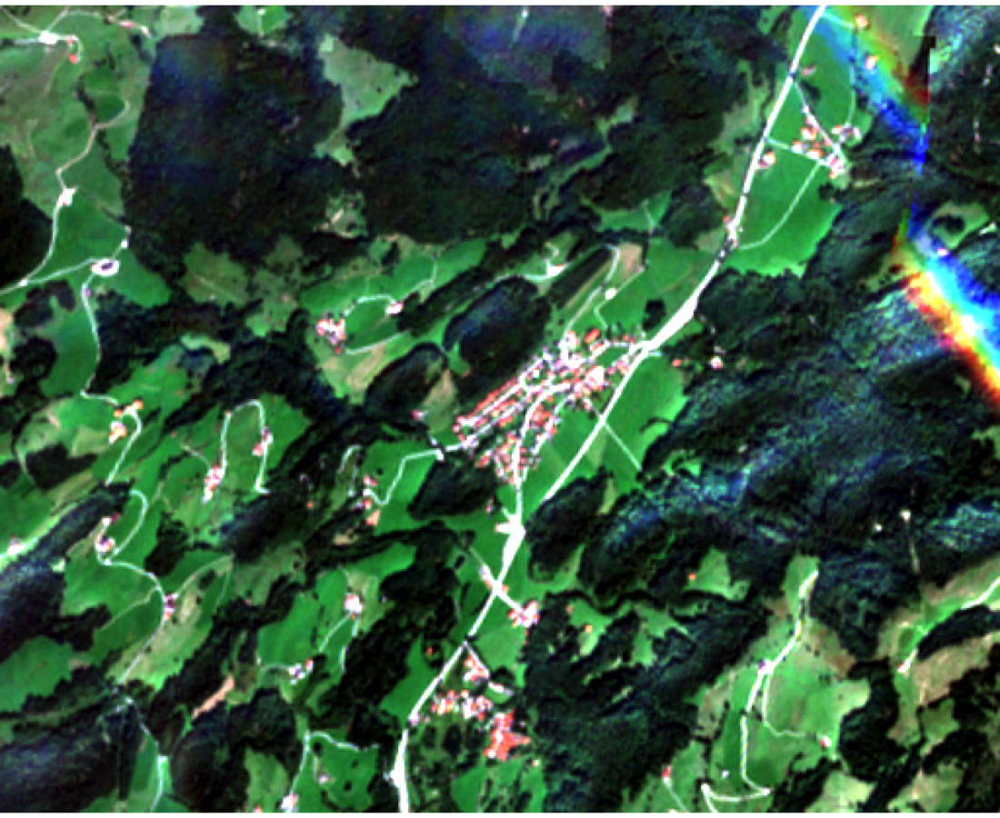
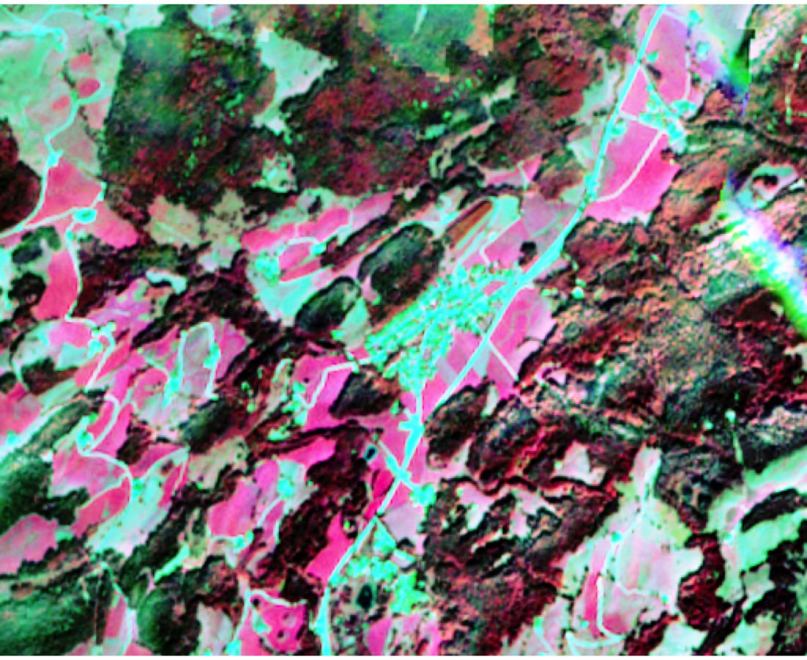
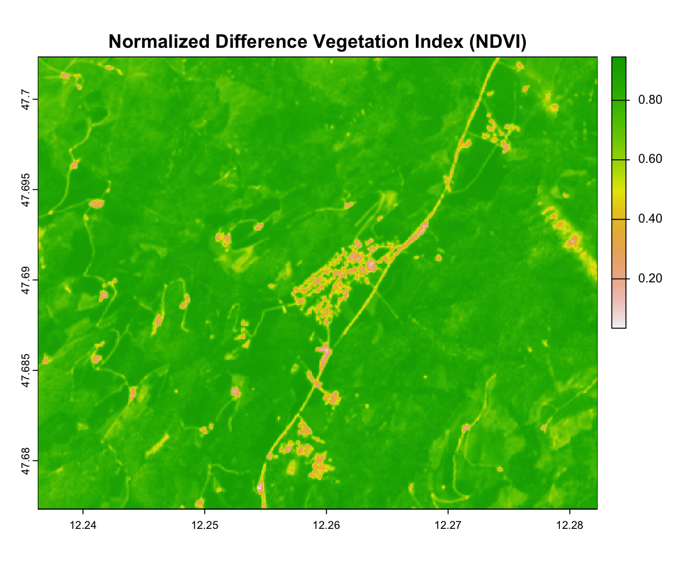

# Sentinel-2 Analysis of Sachrang

## Step 1: RGB Composites

The true-color composite (Bands 4-3-2) shows the landscape as seen by the human eye:  

The false-color composite (Bands 8-4-3) highlights vegetation in red tones:  

## Step 2: Spectral Indices

The NDVI highlights vegetation health:  

